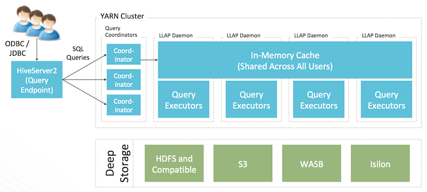
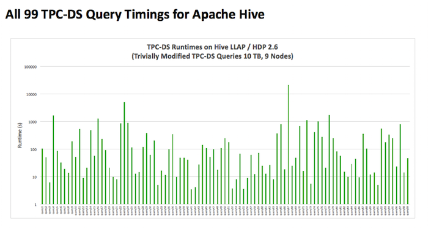
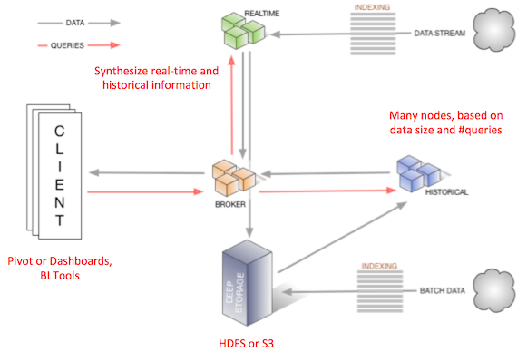
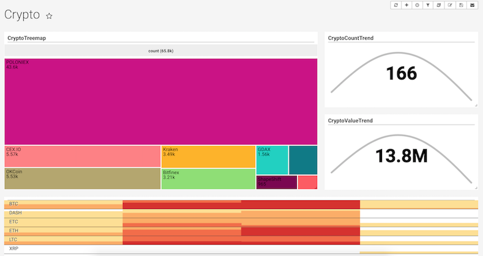
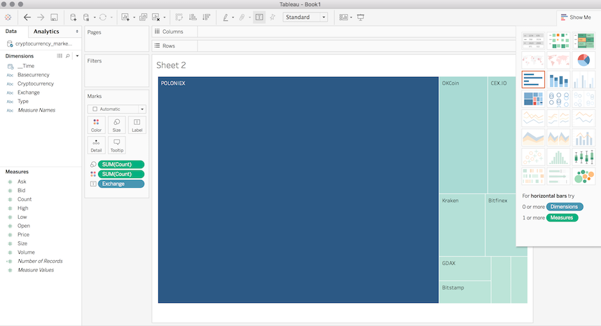



IoTやAIのユースケースがますます増えているのなか、ビッグデータをリアルタイムにSQLでクエリする需要が高まっている。こちらを実現するソリューションとして、Apache Hive と Druid の組合せが魅力です。

- Apache Hive と Druid とも実績の高いオープンソースソフトウェア（OSS）。
- 両方とも非常に大量のデータでも対応できるスケールアウト・アーキテクチャ。
- Apache Hive と Druid 自体や依存コンポネント全ては、Apache Ambariを使ってGUIウィーザーでインストール可能。
- 簡単な設定だけで連携可能。

今回はApache HiveとDruidを使ったリアルタイムSQL処理を、サンプルみながら説明する。

# Apache Hive 2とは
[Apache Hive](http://hive.apache.org "Apache Hive")はHadoop上のSQLデータ・ウェアハウスです。最新のHive 2.2は新しいLLAPエンジン追加や、SQLサポートの強化など、大きく進化したビッグデータのSQLソリューションの事実上の標準となっている。

- 全て99個のTPC-DSクエリを含む包括的なANSI SQLサポート。
- 簡単な更新を可能にするACID MERGEを対応対応した唯一のHadoop SQLソリューション。
- メモリ内キャッシュにより、MPPデータ・ウェアハウスと同レベルのパフォーマンスをHadoopスケールで実現。
- ユーザーごとの動的な行と列レベルのセキュリティ。
- すべての主要なBIツールと連携。
- 300PB以上のスケール実績がある。





# Druidとは

[Druid](http://druid.io "Druid")は、大量のデータをすばやく取り込み、索引付けし、リアルタイムなクエリを可能にするための分散型、リアルタイム、列指向のデータストアです。以下の特徴がある：

- ストリーミング的にデータ投入
- 秒以下のクエリ速度
- 蓄積データとリアルタイムデータの融合
- 高速な近似計算



# 仮想通貨データのリアルタイム分析

この例では、[Satori](https://www.satori.com)のcryptocurrency-market-dataチャネルからデータをストリーミングして索引付けします。 そこから、SQLを使用してデータを分析したり、[Apache Superset](https://github.com/apache/incubator-superset)可視化レイヤーを上に置くことができます。

この例は[こちら](https://github.com/cartershanklin/druid-satori-demo)のコードを参照している。

# 前提条件

Satoriアカウントが必要です。Satoriからデータを取得するための app key が要る。アカウントは [https://www.satori.com/](https://www.satori.com/) よる取得する。

Python、Druid、KafkaやHiveも必要です。[Hortonworks HDP 2.6+](https://hortonworks.com/products/data-platforms/hdp/) がこれらすべて入っているためお勧めです。

# 実行手順

[こちらのGithub repo](https://github.com/cartershanklin/druid-satori-demo)よりサンプルコードをダウンロードし、順番に下記スクリプトを実行する。

- `00setup.sh` を実行し、Pythonの依存ライブラリをインストール。
- `01satori_cryptocurrency_kafka.py` を変更し、Satoriより取得した自分の app key を入れる。
- `01satori_cryptocurrency_kafka.py` を実行しSatoriのデータをKafkaに投入。必要に応じて、`01satori_cryptocurrency_kafka.py -k kafka:port` を実行し、Kakfaサーバーとポートを指定する。
- 別ターミナルより、03start_supervisor.sh を実行し、Kafkaよりデータを取得しDruidに索引を付ける。
- `04query_rest.sh` でデータをクエリする。最初のクエリは少し時間がかかる場合がある。

ここまでで、Satoriより仮想通貨データをリアルタイムに取得し、Kafkaに入れたあと、Druidにデータを投入しつつ索引付けを行った。問題なく行えば、最後のクエリにこのような結果が返ってくる。

```json
$ ./04query_rest.sh
[ {
  "timestamp" : "2017-11-29T09:45:00.000Z",
  "result" : [ {
    "count" : 1402,
    "cryptocurrency" : "LTC"
  }, {
    "count" : 1224,
    "cryptocurrency" : "BTC"
  }, {
    "count" : 1212,
    "cryptocurrency" : "ETH"
  }, {
    "count" : 887,
    "cryptocurrency" : "DASH"
  }, {
    "count" : 745,
    "cryptocurrency" : "BCH"
  } ]
},
...
]
```

## 可視化とダッシュボード

[Apache Superset (incubating)](https://github.com/apache/incubator-superset) を用いてDruidに投入された仮想通貨データのリアルタイム・ダッシュボードを簡単に作成する。



## HiveからSQLでデータ分析

DruidデータをHiveからSQLでクエリ可能です。

DruidをストレージとするHive外部テーブルを作成。

```bash
#!/bin/sh

cat<<EOF>/tmp/create_table.sql
SET hive.druid.broker.address.default=<DRUID_BROKER_HOST>:<DRUID_BROKER_PORT>;
CREATE EXTERNAL TABLE if not exists cryptocurrency_market_data
STORED BY 'org.apache.hadoop.hive.druid.DruidStorageHandler'
TBLPROPERTIES ("druid.datasource" = "cryptocurrency-market-data");
EOF

HS2=${1:-<HIVE_LLAP_HOST>:<HIVE_LLAP_PORT>}
BEELINE="beeline -u jdbc:hive2://$HS2/default"
$BEELINE -f /tmp/create_table.sql
```

SQLで問合せしてみる。
```SQL
select cryptocurrency, count(*) c from cryptocurrency_market_data group by cryptocurrency order by c;

| XRP             | 3023  |
| BCH             | 3862  |
| ZEC             | 4144  |
| DASH            | 4646  |
| ETC             | 4662  |
| LTC             | 6572  |
| ETH             | 6660  |
| BTC             | 7212  |
+-----------------+-------+--+
69 rows selected (0.692 seconds)
```

SQLを何回か実行すると、結果がリアルタイムに変わっていることが分かる。Druidにリアルタイムに投入されたデータが、HiveからSQLでリアルタイムに問合せできている。

Tableauから、Hiveに接続しデータを可視化してみる。


